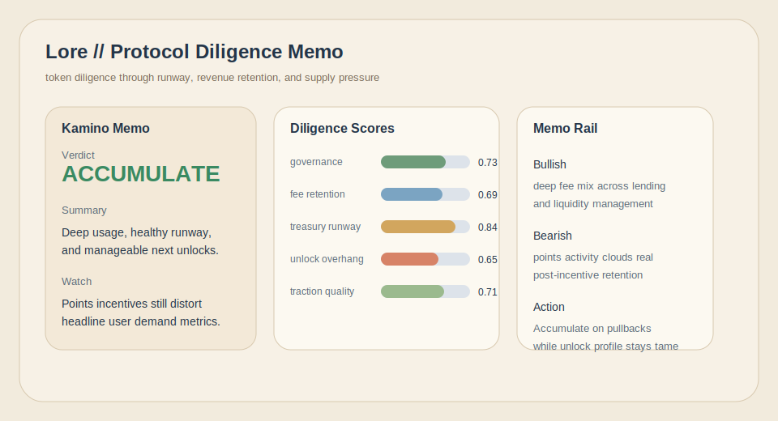
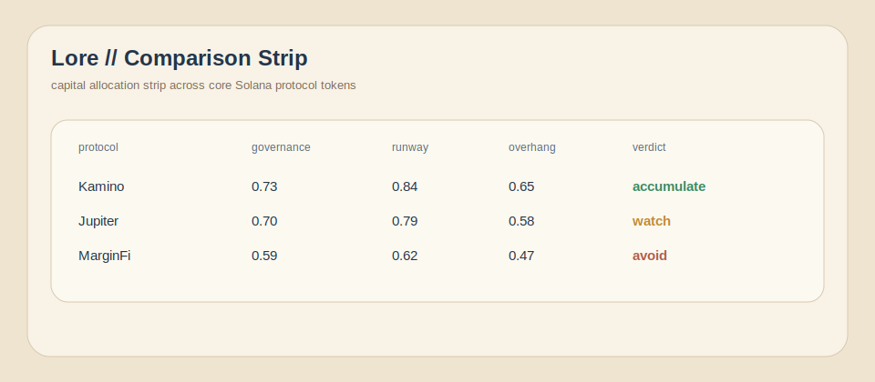

# Lore

Protocol diligence engine for Solana token buyers.

Turn token research into a capital-allocation memo in one pass.

`bun run dev`

- scores governance concentration, fee retention, treasury runway, unlock pressure, and traction quality
- ignores vanity TVL and narrative fluff that do not help underwrite the token
- promotes protocols where demand quality can realistically absorb future supply

[](https://github.com/LoreResearch/Lore/actions)


## Research Board



## Comparison Strip



## Operating Surfaces

- `Research Board`: shows the current memo with governance, runway, and unlock context
- `Comparison Strip`: keeps multiple Solana protocols on one allocation plane
- `Diligence Score`: compresses five underwriting dimensions into one ranking
- `Protocol Memo`: gives a buyer the exact reasons capital should move or wait

## What Lore Scores

Lore uses a five-part diligence model:

`overall = mean(governance, feeRetention, treasuryRunway, unlockOverhang, tractionQuality)`

This shifts the question from "is the protocol popular" to "can the token absorb supply and still justify capital".

## Technical Spec

### Governance

`governance = 0.45 * auditDepth + 0.35 * insiderDispersion + 0.20 * operatingMaturity`

Protocols with heavy insider ownership or weak audit posture lose points even if TVL is strong.

### Fee Retention

`feeRetention = 0.55 * feeMargin + 0.45 * normalizedFees`

Usage only matters when it converts into protocol revenue that can support token value.

### Treasury Runway

`runwayMonths = treasuryUsd / monthlyBurnUsd`

`treasuryRunway = clamp(runwayMonths / 24)`

Lore favors teams that can keep shipping without relying on immediate token supply overhang.

### Unlock Overhang

`unlockOverhang = 1 - (0.65 * unlockPct90d + 0.35 * valuationStretch)`

High next-90-day unlocks are treated as a hard drag unless valuation and demand are unusually strong.

### Traction Quality

`tractionQuality = 0.45 * normalizedTVL + 0.30 * recentGrowth + 0.25 * activeUsage`

Traction is not just TVL size. Growth quality matters.

## Quick Start

```bash
git clone https://github.com/LoreResearch/Lore
cd Lore
npm install
cp .env.example .env
npm run dev
```

## Local Audit Docs

- [Commit sequence](docs/commit-sequence.md)
- [Issue drafts](docs/issue-drafts.md)

## Support Docs

- [Runbook](docs/runbook.md)
- [Changelog](CHANGELOG.md)
- [Contributing](CONTRIBUTING.md)
- [Security](SECURITY.md)

## License

MIT
